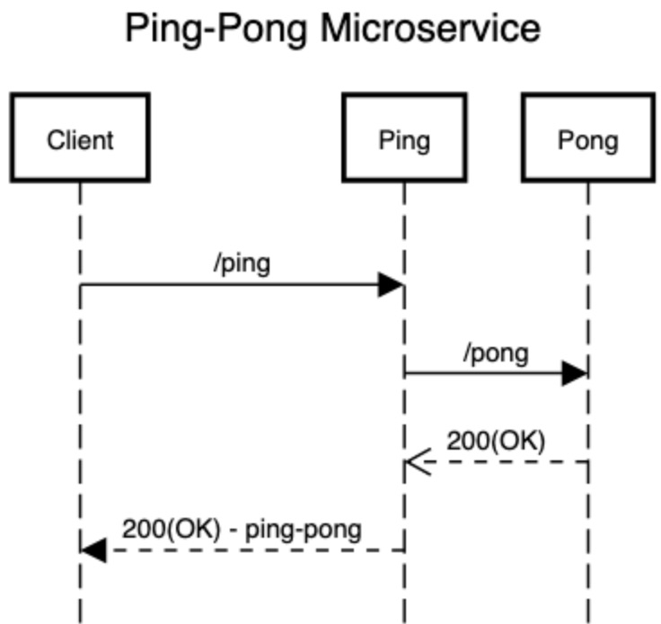
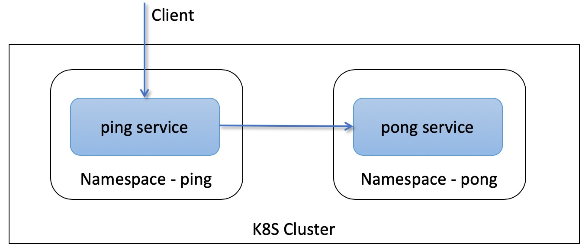

# ping-pong-istio-microservices
Sample Microservices to demonstrate Istio Authorization Policies


Deploys 2 microservices
1. demo-ping-microservice
2. demo-pong-microservice 



Services are deployed in different namespaces



##Setup

### Prerequisite setup
1. Istio - Install using one any of the options - https://istio.io/docs/setup/install/
2. Helm - Install Helm - https://helm.sh/docs/intro/install/
3. Docker CLI - Personally like Docker for Desktop - https://docs.docker.com/docker-for-mac/

### Prepare the environment
#### Create the namespaces
```
kubectl create ns ping
kubectl label namespace ping istio-injection=enabled

kubectl create ns pong
kubectl label namespace pong istio-injection=enabled
```
 
#### Configure Istio Deny-All policies
Configure istio to reject all requests by default
```
kubectl apply -f istio-authorization-policy-deny-all.yaml
```

#### Setup Istio ingress gateway
```
kubectl apply -f http-gateway.yaml
```

### Compile, Build and Deploy the services
Build ping service
```
cd demo-ping-service
./mvnw clean package
docker build -t demo-ping-service:v1 .
```
Deploy
```
helm install --name demo-ping-service .\charts\demo-ping-service\
```

Build pong service
```
cd demo-pong-service
./mvnw clean package
docker build -t demo-pong-service:v1 .
```
Deploy
```
helm install --name demo-ping-service .\charts\demo-pong-service\
```


## Apply Authorization Policies
Due to the deny-all policies all communications across the services are blocked. To enable

Enables inbound access to the ping service
```
kubectl apply -f c:\istio\enableaccessto-ping-ns.yaml
```

Enables access to pong services from the ping namespace
```
kubectl apply -f c:\istio\enableaccessfrom-ping-ns-to-demo-ping-svc.yaml
```

If running local enable port forwarding 
```
kubectl -n istio-system port-forward istio-ingressgateway-podname 8080:80
```

If setup properly the app should be accessible at
http://localhost:8080/ping

Any policy mismatch results in 'RBAC Access Denied'

### Undeploy
```
helm delete --purge demo-ping-service
helm delete --purge demo-pong-service
```